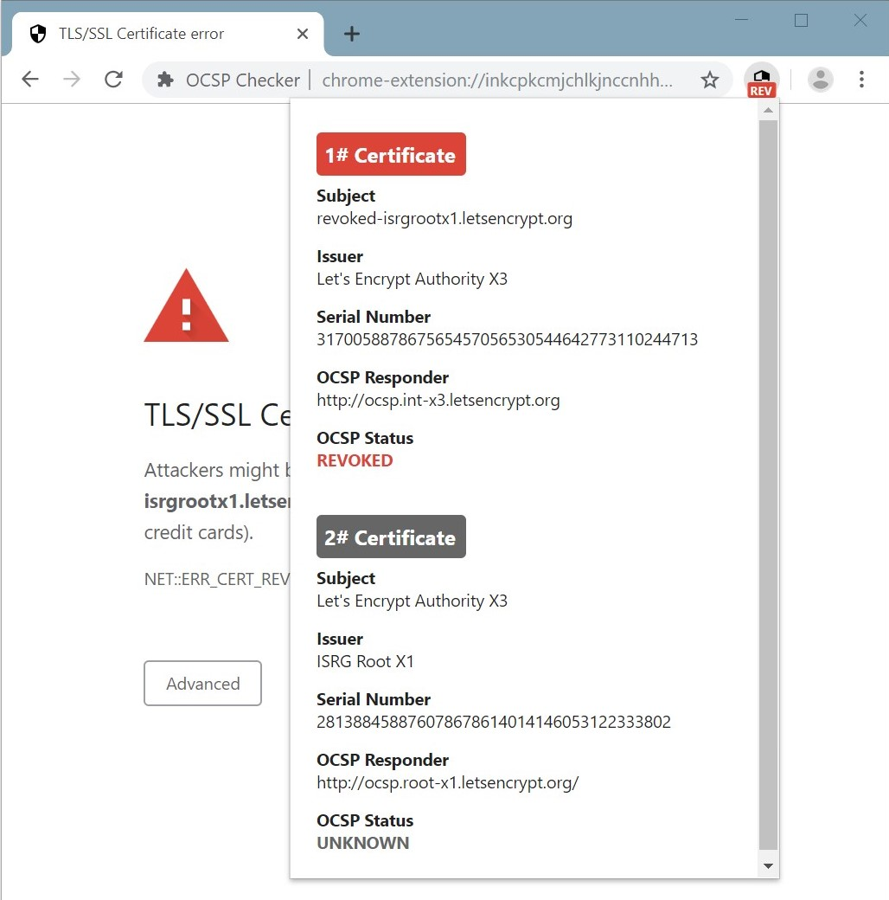

## OCSP Checker
OCSP Checker is a browser extension for Chrome that performs an OCSP request to obtain the revocation status of all used SSL certificates on the currently visited website.

Due to restrictions in the Chrome APIs the OCSP request cannot be performed by the browser itself. Therefore the request is done on a server which provides a simple [REST Api](https://github.com/bbindreiter/ocspchecker_server) to trigger the OCSP Request and retrieve the results. The only information passed to the server is the domain (not the entire URL). 

The results of the OCSP request (plus some basic certificate information) is displayed in a popup when clicking the extension's icon in the browser's menu bar. If one of the certificates is revoked the extension displays an error page (or only warning if changed in settings).
 
[Open Extension in Chrome Web Store](https://chrome.google.com/webstore/)  
[Chrome Checker Server REST Api](https://github.com/bbindreiter/ocspchecker_server)

###Screenshots

